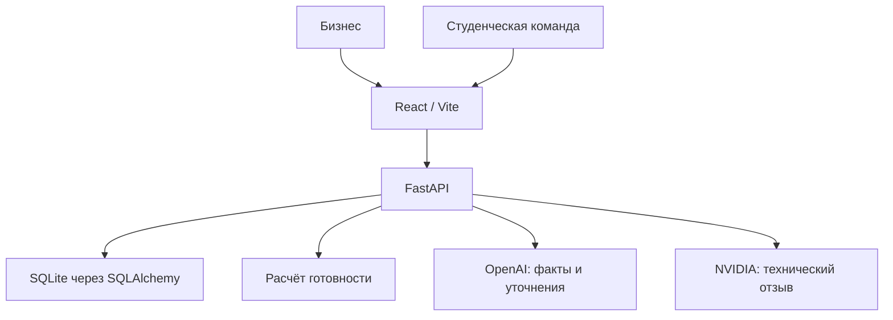

# SanaBridge — AI Sana Challenge Hub

**Превращаем краткое описание бизнес-проблемы в понятную AI-задачу и соединяем её со студенческой командой.**

Хакатонный MVP для кейса **МНВО — AI Sana** на HackAlem AI.

> Для демонстрации без API-ключей запустите приложение и выберите **«Создать задачу» → «Загрузить демо»**. Чтобы проверить AI-анализ собственного описания, настройте OpenAI API.

## 1. Краткое описание

Бизнес часто описывает задачу несколькими предложениями: из такого описания сложно понять, что нужно разработать, какие данные доступны и как оценить результат. Студенческие команды вынуждены самостоятельно восстанавливать недостающие требования.

SanaBridge помогает бизнесу последовательно уточнить задачу, увидеть полноту брифа и опубликовать структурированную карточку. Студенты могут изучить задачи, отправить заявку от команды и предложить свой опыт. Бизнес получает заявки и выбирает исполнителя.

**Пользователи:** представители бизнеса и организаций с задачами для AI-проектов; студенческие команды, ищущие практические проекты.

## 2. Что реализовано

| Возможность | Реализация |
|---|---|
| Создание задачи | Ввод исходного описания, AI-анализ или ручное заполнение |
| Извлечение фактов | Проблема, цель, пользователи, данные, результат, метрики, ограничения и сроки |
| Проверка AI-вывода | Pydantic-схема; извлечённые значения сверяются с исходным текстом |
| Уточнение брифа | До трёх вопросов за раунд; ответы сохраняются в соответствующие поля |
| Готовность | Детерминированный процент, веса критериев, список пробелов и история баллов |
| Предложения AI | Навыки команды и возможное направление решения, отмеченные отдельно от фактов |
| Технический отзыв | Необязательная проверка NVIDIA: реализуемость, данные, риски и вопросы |
| Публикация | Доступна после заполнения всех восьми критериев |
| Каталог | Карточки задач и поиск по названию, проблеме и предложенным навыкам |
| Заявки | Название команды, число участников, навыки, GitHub и мотивация |
| Выбор команды | Один победитель; остальные заявки получают статус `REJECTED`, дальнейший приём закрывается |
| Хранение | SQLite сохраняет задачи, вопросы, баллы, отзывы и заявки |
| Интерфейс | Русский язык, адаптивная вёрстка, состояния загрузки, ошибок и пустых списков |
| Демо | Явно помеченный вымышленный кейс без вызова внешних AI-сервисов |

### Как считается готовность

Модель не назначает процент: backend суммирует веса заполненных полей.

| Критерий | Вес |
|---|---:|
| Проблема | 15 |
| Цель бизнеса | 15 |
| Пользователи | 10 |
| Доступные данные | 15 |
| Ожидаемый результат | 15 |
| Метрики успеха | 15 |
| Ограничения | 5 |
| Сроки | 10 |
| **Всего** | **100** |

Пустые строки, пробелы и предусмотренные заглушки, например `unknown`, `не указано` и `TBD`, не засчитываются. Конфигурация находится в [readiness.py](backend/app/services/readiness.py).

Пример расчёта: заполнена проблема — **15%**; добавлены цель и данные — **45%**; заполнены все критерии — **100%**. Начальный балл AI-анализа не фиксируется заранее.

**Готовность показывает полноту брифа, а не качество требований или доказанную реализуемость.** AI-предложения и технический отзыв NVIDIA на баллы не влияют.

## 3. Как работает решение

1. **Описание.** Бизнес вводит проблему своими словами.
2. **Анализ.** Backend отправляет описание в OpenAI и получает структурированный ответ. Неизвестные поля остаются пустыми; значения, отсутствующие в исходном тексте, отбрасываются.
3. **Уточнение.** Пользователь видит готовность и вопросы, добавляет ответы. Новые ответы сохраняются дословно; AI не перезаписывает ранее сохранённые факты. Есть сохранение без AI и ручное редактирование брифа.
4. **Проверка.** Бизнес просматривает карточку и при желании запрашивает технический отзыв NVIDIA.
5. **Публикация.** При 100% готовности задача появляется в каталоге. После публикации бриф фиксируется для команд.
6. **Заявка.** Студенческая команда открывает карточку и отправляет сведения о себе.
7. **Выбор.** Владелец открывает заявки и выбирает одну команду. Результат сохраняется в базе.

## 4. Технологии

| Компонент | Технологии |
|---|---|
| Frontend | JavaScript, React 19, Vite 6, React Router, CSS, Lucide React |
| Backend | Python, FastAPI, Uvicorn, Pydantic, pydantic-settings |
| База данных | SQLite, SQLAlchemy 2 |
| Основной AI | OpenAI Python SDK, Responses API, `responses.parse`, структурированный вывод |
| Технический отзыв | NVIDIA API, HTTPX, проверка результата через Pydantic |
| Тестирование | Pytest, HTTPX, Playwright |
| Форматирование | Prettier |
| Автоматизация | GitHub Actions: `.github/workflows/ci.yml` |

**Модели по умолчанию в конфигурации:**

- OpenAI: `gpt-4.1-mini`, переменная `OPENAI_MODEL`.
- NVIDIA: `meta/llama-3.3-70b-instruct`, переменная `NVIDIA_MODEL`.

Это настроенные идентификаторы, а не подтверждение доступности моделей в конкретном аккаунте. Версии Python-зависимостей закреплены в [requirements.txt](backend/requirements.txt); версии frontend-зависимостей — в [package-lock.json](frontend/package-lock.json).

## 5. Архитектура проекта



Браузер обращается к относительному пути `/api`. Vite проксирует запросы на `http://127.0.0.1:8000`; это настроено и для режима разработки, и для локального preview. Backend проверяет данные и права владельца, вызывает AI-сервисы и сохраняет результат в SQLite. AI-ключи используются только на backend.

| Путь | Назначение |
|---|---|
| `backend/app/main.py` | Запуск API, подключение маршрутов, CORS, обработка ошибок |
| `backend/app/config.py` | Переменные окружения и настройки |
| `backend/app/database.py`, `models.py` | Подключение к базе и модели `Challenge`, `Application` |
| `backend/app/schemas.py` | Валидация запросов и структур ответов |
| `backend/app/security.py` | Проверка ключа рабочего пространства и владельца |
| `backend/app/routes/` | Задачи, публикация, заявки, технические отзывы и демо |
| `backend/app/services/` | AI-интеграции, промпты, готовность, работа с задачами |
| `frontend/src/pages/` | Главная, каталог, создание, рабочее пространство и карточка задачи |
| `frontend/src/components/` | Карточки, факты, готовность и общие элементы интерфейса |
| `frontend/src/services/api.js` | Единый API-клиент и ключ рабочего пространства |
| `backend/tests/`, `frontend/e2e/` | Backend- и браузерные тесты |
| `scripts/smoke_test.py` | HTTP-сценарий с перезапуском сервера и проверкой сохранения |

### Доступ к задачам

Frontend создаёт случайный ключ рабочего пространства, хранит его в `localStorage` и отправляет в заголовке `X-Business-Key`. Backend хранит SHA-256 ключа. Черновики, редактирование, просмотр заявок и выбор команды доступны владельцу. Каталог и отправка заявки доступны без ключа.

Это упрощённый механизм доступа для MVP. Аккаунтов и восстановления доступа нет. Используйте один адрес сайта постоянно: `localhost` и `127.0.0.1` имеют разные хранилища браузера.

## 6. Установка и запуск

### Подготовка

Используйте **Python 3.12**, **Node.js 22** и npm — эти версии Python и Node указаны в CI-конфигурации. Распакуйте проект и откройте его корень: папку, содержащую `backend`, `frontend` и `README.md`.

Для работы нужны два одновременно открытых терминала: backend и frontend. Команды установки приведены для первого запуска; при последующих запусках достаточно запускать серверы.

### macOS / Linux — backend

Из корня проекта:

```bash
python3.12 -m venv .venv
.venv/bin/python -m pip install -r backend/requirements.txt
cp backend/.env.example backend/.env
```

Если Python 3.12 установлен как `python3`, проверьте `python3 --version` и используйте его вместо `python3.12`.

Настройте `backend/.env`, затем запустите:

```bash
cd backend
../.venv/bin/python -m uvicorn app.main:app --reload --host 127.0.0.1 --port 8000
```

### Windows — backend

Откройте **PowerShell** в корне проекта:

```powershell
py -3.12 -m venv .venv
.\.venv\Scripts\python.exe -m pip install -r backend\requirements.txt
Copy-Item backend\.env.example backend\.env
```

Настройте `backend/.env`, затем запустите:

```powershell
cd backend
..\.venv\Scripts\python.exe -m uvicorn app.main:app --reload --host 127.0.0.1 --port 8000
```

Активация виртуального окружения не требуется: команды обращаются к его Python напрямую.

### Переменные окружения

| Переменная | Назначение |
|---|---|
| `OPENAI_API_KEY` | Ключ для AI-анализа и уточнений. Не нужен для ручного режима и демо |
| `OPENAI_MODEL` | Модель OpenAI; по умолчанию `gpt-4.1-mini` |
| `NVIDIA_API_KEY` | Необязательный ключ технического рецензента |
| `NVIDIA_MODEL` | Модель NVIDIA; по умолчанию `meta/llama-3.3-70b-instruct` |
| `DATABASE_URL` | По умолчанию `sqlite:///./sanabridge.db` |
| `CORS_ORIGINS` | JSON-массив разрешённых адресов; в шаблоне localhost и 127.0.0.1 на порту 5173 |

Шаблон: [backend/.env.example](backend/.env.example). Замените заглушки ключами для нужных интеграций. Не публикуйте настоящий `.env`: он исключён через `.gitignore`.

Файл настроек читается из `backend/.env`. При запуске из `backend` база автоматически создаётся как `backend/sanabridge.db`. Относительный путь SQLite зависит от рабочей папки процесса, поэтому соблюдайте приведённые команды.

### Frontend — второй терминал, обе системы

Откройте новый терминал **в корне проекта**:

```bash
cd frontend
npm ci
npm run dev
```

Оставьте оба сервера работающими и откройте:

- Приложение: [http://localhost:5173](http://localhost:5173).
- Документация API: [http://127.0.0.1:8000/docs](http://127.0.0.1:8000/docs).
- Проверка запуска backend: [http://127.0.0.1:8000/api/health](http://127.0.0.1:8000/api/health).

Если порт 5173 занят, Vite может предложить другой адрес; для воспроизводимого демо освободите 5173. Остановить сервер можно сочетанием `Ctrl+C` в его терминале.

### Локальная проверка сборки

Из папки `frontend`:

```bash
npm run build
npm run preview
```

Откройте адрес, выведенный Vite. Backend на порту 8000 должен продолжать работать: сборка frontend не включает Python-сервер.

## 7. Как проверить решение

### Сценарий для жюри с AI

1. Настройте OpenAI, запустите оба сервера и откройте приложение.
2. Нажмите **«Создать задачу» → «Попробовать пример»**. В форме появится:

   > Мы хотим использовать AI для анализа отзывов студентов.

3. Нажмите **«Проанализировать с AI»**. Проверьте исходные факты, незаполненные поля, вопросы и готовность. Не ожидайте заранее заданного начального процента.
4. Ответьте на вопросы через **«Сохранить и уточнить с AI»**. При необходимости используйте **«Изменить»** в брифе. Для вымышленного демонстрационного бизнеса можно подтвердить следующие сведения:

| Поле | Демонстрационный ответ |
|---|---|
| Проблема | Учебный отдел вручную разбирает отзывы и пропускает повторяющиеся проблемы |
| Цель | Сократить ежемесячный анализ с двух дней до двух часов |
| Пользователи | Учебный отдел и руководители образовательных программ |
| Данные | 5000 обезличенных отзывов на русском языке в CSV; доступ с начала проекта |
| Результат | Веб-прототип с загрузкой CSV, темами, тональностью и экспортом отчёта |
| Метрики | Macro-F1 не ниже 0.80 на 300 размеченных отзывах, отчёт за 2 минуты |
| Ограничения | Только обезличенные данные, без платной инфраструктуры |
| Сроки | 30 ноября 2026 года |

5. Проверьте изменение готовности после сохранения. При заполнении всех критериев она составит 100%.
6. Просмотрите факты и отдельно AI-предложения. Нажмите **«Проверить»** в блоке NVIDIA. При настроенном ключе ожидается технический отзыв; без ключа отображается неблокирующее состояние недоступности.
7. Нажмите **«Опубликовать задачу»**, затем откройте её в каталоге.
8. В отдельном браузере или приватном окне откройте тот же адрес сайта и отправьте заявку: название `Qadam AI`, 4 участника, навыки `Python, NLP, React`, ссылка `https://github.com/qadam-demo`, мотивация от 20 символов. Ссылка — пример для теста, принадлежность команде не подтверждается.
9. В исходном окне бизнеса откройте **«Мои задачи» → свою задачу**. Если страница уже открыта, обновите её. В заявках нажмите **«Выбрать команду»**.
10. Обновите страницу и перезапустите backend с той же базой. Выбранная команда должна сохраниться; остальные заявки получают статус `REJECTED`.

**Ожидаемый результат:** опубликованная задача и одна выбранная команда в базе данных.

### Сценарий без API-ключей

**«Создать задачу» → «Загрузить демо» → «Опубликовать задачу» → каталог → заявка → «Мои задачи» → выбор команды.**

Демо сразу создаёт заполненный бриф и явно помечает его как вымышленный. Это не результат AI-анализа. Для проверки роста готовности создайте задачу через **«Заполнить бриф вручную»** и добавляйте поля по частям.

### Автоматические проверки

Команды для macOS/Linux, начиная из корня проекта:

```bash
cd backend
../.venv/bin/python -m pytest -q
cd ..
.venv/bin/python scripts/smoke_test.py
cd frontend
npm run build
npx prettier --check src vite.config.js playwright.config.js e2e package.json
npx playwright install chromium
npm run test:e2e
```

На Windows замените `.venv/bin/python` на `.\.venv\Scripts\python.exe`, а `../.venv/bin/python` — на `..\.venv\Scripts\python.exe`. Для Playwright задайте путь к Python **из корня проекта**, затем перейдите в `frontend`:

```powershell
$env:SANABRIDGE_PYTHON = '"' + (Resolve-Path .venv\Scripts\python.exe).Path + '"'
cd frontend
npx playwright install chromium
npm run test:e2e
```

Перед браузерными тестами остановите обычные серверы на 8000 и 5173: Playwright запускает свои процессы. Его backend использует `backend/e2e.db` и пустые AI-ключи. На Linux при нехватке системных библиотек используйте `npx playwright install --with-deps chromium`.

В проекте есть:

- Backend-тесты расчёта готовности, API, прав владельца, заявок и обработки ошибок AI.
- Тесты OpenAI SDK с подменённым HTTP-транспортом: строгая схема, разбор ответа, отказ и повреждённый JSON.
- Проверки NVIDIA с тестовыми ответами и ошибками.
- Браузерные сценарии бизнеса и студента, ручного заполнения и мобильной ширины.
- `smoke_test.py`, который проходит настоящий HTTP-сценарий на порту 8123 с временной SQLite и проверяет сохранение после перезапуска.

В [docs/VALIDATION.md](docs/VALIDATION.md) зафиксирован предыдущий локальный прогон от 23 сентября 2026 года: **27 backend-тестов и 3 браузерных сценария прошли**, сборка и smoke-проверка успешны. Это запись выполненной проверки, а не гарантия результата в другом окружении. При подготовке этого README новые функциональные тесты не запускались.

Workflow [ci.yml](.github/workflows/ci.yml) настроен на `push` и `pull_request`: backend-тесты, smoke, сборка и Playwright. Подтверждения удалённого запуска GitHub Actions в проверенных материалах нет.

## 8. Данные и интеграции

### Данные приложения

Источники — описание и ответы бизнеса, заявки студенческих команд и встроенный демо-кейс. Реальный набор студенческих отзывов, загрузка CSV и анализ самих отзывов в MVP не реализованы: они описывают пример задачи для будущей команды.

SQLite хранит брифы, исходные описания, готовность и её историю, вопросы, AI-предложения, технические отзывы, заявки и их статусы. Публикация открывает карточку и исходное описание через публичный API.

### OpenAI

[openai_service.py](backend/app/services/openai_service.py) передаёт исходное описание и, при уточнении, подтверждённые поля в `responses.parse`. Ответ ограничен схемой `Analysis`. Для извлечённых фактов дополнительно проверяется наличие точной подстроки в предоставленных данных; несовпавшее значение становится `null`.

Тайм-аут клиента — 35 секунд, `max_retries=1`, лимит ответа — 3500 токенов, `store=False`. Ошибка возвращается пользователю как HTTP 503. При неудачном AI-уточнении новые ответы не записываются: их можно отправить повторно или сохранить без AI.

### NVIDIA

[nvidia_service.py](backend/app/services/nvidia_service.py) вызывает:

```text
POST https://integrate.api.nvidia.com/v1/chat/completions
```

Передаются структурированные факты и отдельно AI-предложения. Заявки команд и ключ рабочего пространства в этот запрос не включаются. Результат содержит реализуемость, готовность данных, риски, технические вопросы и краткое заключение.

Тайм-аут — 25 секунд, лимит ответа — 1800 токенов. Результат проверяется схемой `TechnicalReview`. Отсутствующий ключ, ошибка API или некорректный ответ дают состояние `unavailable`; основной сценарий продолжается. При редактировании брифа сохранённый отзыв сбрасывается.

Промпты обеих интеграций находятся в [prompts.py](backend/app/services/prompts.py). Внешние AI-сервисы вызываются только соответствующими действиями пользователя; демо не требует их вызова.

### Основные API-маршруты

| Метод | Путь | Назначение |
|---|---|---|
| GET | `/api/health` | Проверка запуска |
| POST | `/api/challenges/analyze` | AI-анализ с созданием задачи |
| POST | `/api/challenges` | Ручное создание |
| GET | `/api/challenges` | Опубликованные задачи |
| GET | `/api/challenges?scope=mine` | Задачи владельца |
| GET / PATCH | `/api/challenges/{id}` | Чтение / редактирование |
| POST | `/api/challenges/{id}/clarify` | AI-уточнение по ответам |
| POST | `/api/challenges/{id}/review` | NVIDIA-отзыв |
| POST | `/api/challenges/{id}/publish` | Публикация |
| POST / GET | `/api/challenges/{id}/applications` | Подача / просмотр заявок |
| PATCH | `/api/applications/{id}/select` | Выбор команды |
| POST | `/api/demo` | Создание демонстрационного брифа |

Для бизнес-запросов в Swagger используйте один и тот же случайный `X-Business-Key` длиной 32–128 символов. Браузерный клиент формирует его автоматически.

## 9. Ограничения текущей версии

- **Живые AI-вызовы не подтверждены.** В отчёте проверки указаны mock-интеграции; ключи провайдеров при том прогоне не предоставлялись. Перед демонстрацией с AI нужно проверить свои ключи и доступ к выбранным моделям.
- **Готовность бинарная.** Она учитывает наличие ответа, но не оценивает его смысловую достаточность. Срок хранится текстом.
- **AI может ошибиться в интерпретации.** Проверка цитат не доказывает корректность отнесения текста к полю; бизнес должен проверить бриф.
- **Нет полноценной аутентификации.** Ключ в браузере заменяет аккаунт для MVP. Восстановление после утраты ключа не реализовано.
- **Нет защиты от массовых публичных заявок.** CAPTCHA и ограничение частоты отсутствуют. GitHub проверяется как HTTPS-ссылка на `github.com`, без подтверждения владения. В одной задаче запрещены повторные заявки с одинаковым нормализованным GitHub URL.
- **Нет редактирования после публикации и смены победителя.** Эти действия не предусмотрены API.
- **Нет кабинета студента, чата, уведомлений и realtime-обновлений.** Для новых заявок нужно обновить страницу.
- **Списки ограничены 100 задачами.** Постраничная навигация и автоматический подбор команд по навыкам не реализованы.
- **SQLite без миграций.** Таблицы создаются при старте, но существующая схема автоматически не обновляется. PostgreSQL не настроен.
- **Интерфейс русский.** Полной локализации нет; промпт анализа просит отвечать на языке описания, технический отзыв — по-русски.
- **Это сервис постановки задач.** Обработка реальных отзывов, обучение моделей и выполнение самих студенческих проектов не входят в функциональность.

## 10. Развёрнутая версия

**Подтверждённая публичная ссылка в проверенной версии проекта не указана.** Для демонстрации доступны приведённые инструкции локального запуска.

`npm run build` создаёт frontend в `frontend/dist`, но не развёртывает приложение. Для внешнего размещения дополнительно потребуются запуск FastAPI, постоянное хранилище базы, серверные переменные окружения, маршрутизация `/api` и поддержка клиентских маршрутов React.
