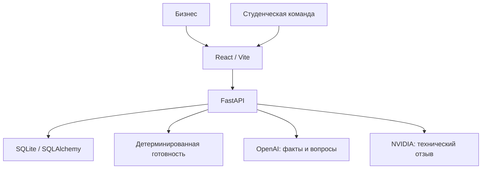

# SanaBridge — AI Sana Challenge Hub

**От неясной бизнес-проблемы к понятной AI-задаче и студенческой команде.**

Хакатонный MVP для кейса МНВО — AI Sana, HackAlem AI. Бизнес описывает проблему, уточняет бриф и публикует задачу. Студенческие команды подают заявки, бизнес выбирает исполнителя.


## Что реализовано

- React-интерфейс на русском: главная, создание задачи, рабочее пространство бизнеса, каталог, карточка задачи, форма заявки.
- OpenAI Responses API со строгой Pydantic-схемой: извлечение фактов, контекстные вопросы, предложения по навыкам и направлению решения.
- Неизвестные факты остаются пустыми. Извлечённое значение принимается только как точная цитата из предоставленного текста; неподтверждённые значения удаляются.
- До трёх вопросов за раунд. Ответы сохраняются в выбранные поля дословно; модель не перезаписывает предыдущие факты.
- Детерминированная готовность, список заполненных/незаполненных критериев, веса и реальная история изменения баллов.
- Ручное создание и редактирование брифа, включая сохранение ответов без AI.
- NVIDIA: отдельный необязательный технический отзыв о реализуемости, данных, рисках и технических вопросах.
- Публикация при заполнении всех восьми критериев, каталог и поиск по названию, проблеме и предложенным навыкам.
- Заявка команды: название, размер, навыки, GitHub и мотивация. Дубликаты GitHub в одной задаче отклоняются.
- Выбор одной команды, отклонение остальных заявок и закрытие дальнейшего приёма. Повторный выбор уже выбранной команды безопасен.
- SQLite: задачи, баллы, вопросы, отзывы, заявки и выбор команды сохраняются между перезапусками.
- Адаптивный интерфейс, загрузка, понятные ошибки и явно помеченный демо-кейс без API-вызовов.

## Как работает решение

1. Бизнес вводит описание и запускает анализ.
2. OpenAI возвращает факты, до трёх вопросов и отдельно AI-предложения.
3. Backend проверяет факты и рассчитывает готовность.
4. Бизнес отвечает на вопросы или редактирует поля вручную. Backend пересчитывает баллы.
5. При желании бизнес запрашивает технический отзыв NVIDIA.
6. При готовности 100% задача публикуется. После публикации бриф фиксируется.
7. Студенческая команда открывает задачу в каталоге и отправляет заявку.
8. Владелец видит заявки в «Моих задачах» и выбирает одну команду.

### Правила готовности

| Критерий | Вес |
|---|---:|
| Проблема | 15 |
| Цель бизнеса | 15 |
| Пользователи | 10 |
| Доступные данные | 15 |
| Ожидаемый результат | 15 |
| Метрики успеха | 15 |
| Ограничения | 5 |
| Сроки | 10 |
| **Итого** | **100** |

Конфигурация: `backend/app/services/readiness.py`. Пустые значения, пробелы и стандартные заглушки вроде `unknown`, `не указано`, `TBD` не засчитываются. Упоминание отсутствия ограничений — допустимый ответ, если его подтвердил бизнес.

**Готовность отражает заполненность брифа, а не качество текста или техническую реализуемость.** LLM не задаёт процент. AI-предложения и отзыв NVIDIA не добавляют баллы. Порог публикации MVP — все 8 критериев. Пример реального расчёта: проблема 15 → добавлены цель и данные 45 → заполнены остальные критерии 100. Начальный балл AI-анализа заранее не фиксируется.

## Технологии

- Python 3.12, FastAPI, Pydantic, pydantic-settings, SQLAlchemy 2, SQLite, Uvicorn.
- React 19, Vite 6, React Router, Lucide React, CSS.
- OpenAI Python SDK: `AsyncOpenAI.responses.parse`, Structured Outputs, `store=False`.
- OpenAI-модель по умолчанию: `gpt-4.1-mini`, настраивается через `OPENAI_MODEL`.
- NVIDIA API Catalog: `POST https://integrate.api.nvidia.com/v1/chat/completions`, через HTTPX.
- NVIDIA-модель по умолчанию: `meta/llama-3.3-70b-instruct`, настраивается через `NVIDIA_MODEL`.
- Pytest и HTTPX для backend, Playwright для браузера, Prettier для форматирования frontend.
- Точные установленные версии зафиксированы в `backend/requirements.txt` и `frontend/package-lock.json`.

Доступность моделей зависит от ключа и аккаунта. Изменение модели OpenAI требует поддержки Responses API и структурированного вывода.

## Архитектура



```text
backend/
  app/
    config.py, database.py, models.py, schemas.py, security.py, main.py
    routes/       # задачи, заявки, технический отзыв, демо
    services/     # AI, промпты, готовность, работа с задачей
  tests/          # модульные, API и интеграционные тесты с mock-ответами
  requirements.txt
  .env.example
frontend/
  src/components/ # готовность, карточки, ошибки, факты
  src/pages/      # экраны пользователя
  src/services/   # единый API-клиент
  e2e/            # браузерные сценарии
scripts/smoke_test.py  # настоящий HTTP-сценарий с перезапуском сервера
docs/                 # скриншоты и отчёт проверки
```

Браузер обращается к `/api`; Vite проксирует запросы на `http://127.0.0.1:8000`. API-ключи остаются на backend. В production потребуется reverse proxy для `/api` и SPA fallback; внешнего развёртывания в этом проекте нет.

## Установка и запуск

Нужны **Python 3.12**, **Node.js 22** и npm. Команды ниже выполняются из корня распакованного проекта `sanabridge` на macOS/Linux.

### 1. Backend

```bash
python3 -m venv .venv
.venv/bin/python -m pip install -r backend/requirements.txt
cp backend/.env.example backend/.env
```

В `backend/.env` замените `OPENAI_API_KEY` своим ключом. `NVIDIA_API_KEY` необязателен. Не вставляйте ключи в JavaScript или README.

```bash
cd backend
../.venv/bin/python -m uvicorn app.main:app --reload --host 127.0.0.1 --port 8000
```

SQLite создаётся автоматически при старте в `backend/sanabridge.db`. `.env` читается по абсолютному пути относительно приложения; относительный путь к базе считается от рабочей директории процесса, поэтому запускайте из `backend`.

### 2. Frontend — отдельный терминал, из корня проекта

```bash
cd frontend
npm ci
npm run dev
```

Откройте [http://localhost:5173](http://localhost:5173). Swagger: [http://127.0.0.1:8000/docs](http://127.0.0.1:8000/docs). Проверка сервера: [http://127.0.0.1:8000/api/health](http://127.0.0.1:8000/api/health).

Для Windows создайте окружение через `py -3.12 -m venv .venv`, затем используйте `.venv\Scripts\python.exe` вместо `.venv/bin/python`, а из `backend` — `..\.venv\Scripts\python.exe`. Скопируйте `.env.example` командой `Copy-Item backend/.env.example backend/.env`. Frontend запускается теми же npm-командами.

### Сборка frontend

```bash
cd frontend
npm run build
npm run preview
```

Для preview backend также должен работать на порту 8000. Статическая сборка сама Python-сервер не запускает.

## Как проверить решение

### Полный AI-сценарий для жюри

1. Настройте ключ OpenAI, запустите оба сервера.
2. Откройте «Создать задачу», нажмите «Попробовать пример»:
   > Мы хотим использовать AI для анализа отзывов студентов.
3. Нажмите «Проанализировать с AI». Проверьте, что недостающие данные остаются пустыми, показаны вопросы и готовность.
4. Ответьте на вопросы. При необходимости откройте «Изменить» в брифе. Для воспроизводимой демонстрации можно **от имени вымышленного бизнеса** подтвердить следующие факты:

| Поле | Пример ответа |
|---|---|
| Проблема | Учебный отдел вручную разбирает отзывы и пропускает повторяющиеся проблемы. |
| Цель | Сократить ежемесячный анализ с двух дней до двух часов. |
| Пользователи | Учебный отдел и руководители образовательных программ. |
| Данные | 5000 обезличенных отзывов на русском языке, CSV, доступ с начала проекта. |
| Результат | Веб-прототип с загрузкой CSV, темами, тональностью и экспортом отчёта. |
| Метрики | Macro-F1 ≥ 0.80 на 300 размеченных отзывах, отчёт за 2 минуты. |
| Ограничения | Только обезличенные данные, бюджет инфраструктуры 0. |
| Сроки | 30 ноября 2026 года. |

5. После каждого сохранения проверьте реальное изменение баллов. AI-уточнение сохраняет ответы дословно; «Сохранить без AI» не вызывает внешнюю модель.
6. При 100% проверьте бриф и AI-предложения. Нажмите «Проверить» в блоке NVIDIA: без ключа появится неблокирующее состояние недоступности.
7. Нажмите «Опубликовать задачу», откройте её в каталоге.
8. В отдельном браузерном окне студента заполните заявку: `Qadam AI`, 4 участника, `Python, NLP, React`, `https://github.com/qadam-demo`, мотивация от 20 символов. Это демонстрационные реквизиты, принадлежность GitHub не проверяется.
9. В исходном окне бизнеса откройте «Мои задачи» → задачу. Нажмите «Выбрать команду».
10. Обновите страницу и перезапустите backend: выбранная команда сохранится.

### Надёжный сценарий без внешних API

«Создать задачу» → **«Загрузить демо»** → «Опубликовать задачу» → каталог → заявка → «Мои задачи» → выбрать команду.

Демо-кейс явно помечен. Все его факты вымышлены; модель при создании не вызывается. Никакого реального набора отзывов в архиве нет. Для демонстрации роста готовности используйте ручное заполнение: создайте пустой бриф, заполняйте поля по частям.

### Автоматические проверки

Из корня проекта:

```bash
cd backend
../.venv/bin/python -m pytest -q
cd ..
.venv/bin/python scripts/smoke_test.py
cd frontend
npm run build
npx prettier --check src vite.config.js playwright.config.js e2e package.json
npx playwright install chromium
npm run test:e2e
```

Playwright сам запускает backend и frontend; предварительно остановите серверы на 8000 и 5173. Он использует отдельный `backend/e2e.db` и пустые AI-ключи, не вызывает платные API. На Linux могут понадобиться системные библиотеки: `npx playwright install --with-deps chromium`. Если Python расположен иначе, задайте `SANABRIDGE_PYTHON` абсолютным путём. На Windows, например: `$env:SANABRIDGE_PYTHON=(Resolve-Path .venv\Scripts\python.exe).Path` из корня.

`smoke_test.py` запускает сервер на 8123, создаёт временную базу, проходит HTTP-сценарий, перезапускает процесс и проверяет сохранение выбора. AI-интеграционные тесты проверяют реальные методы установленного SDK с подменённым HTTP-транспортом, включая строгую схему, отказ модели и повреждённый ответ. Реальных запросов к провайдерам в тестах нет.

Добавлен `.github/workflows/ci.yml`: backend-тесты, smoke, frontend build и браузерные тесты. Workflow подготовлен, но удалённый GitHub Actions в этой рабочей среде не запускался.

## API

| Метод | Путь | Назначение |
|---|---|---|
| GET | `/api/health` | Проверка запуска |
| POST | `/api/challenges/analyze` | AI-анализ и создание черновика |
| POST | `/api/challenges` | Создание вручную |
| GET | `/api/challenges` | Опубликованные задачи, максимум 100 |
| GET | `/api/challenges?scope=mine` | Задачи текущего рабочего пространства |
| GET | `/api/challenges/{id}` | Задача и готовность |
| PATCH | `/api/challenges/{id}` | Редактирование неопубликованного брифа |
| POST | `/api/challenges/{id}/clarify` | Сохранение ответов и AI-уточнение |
| POST | `/api/challenges/{id}/review` | Необязательный отзыв NVIDIA |
| POST | `/api/challenges/{id}/publish` | Публикация |
| POST | `/api/challenges/{id}/applications` | Публичная заявка |
| GET | `/api/challenges/{id}/applications` | Заявки для владельца |
| PATCH | `/api/applications/{id}/select` | Выбор команды владельцем |
| POST | `/api/demo` | Создание помеченного демо-черновика |

Бизнес-запросам нужен заголовок `X-Business-Key` со случайной строкой длиной 32–128 символов. Frontend создаёт её автоматически и сохраняет в localStorage; в базе хранится SHA-256. Swagger не создаёт ключ автоматически: для бизнес-запросов укажите один и тот же случайный ключ. Публичное чтение каталога и отправка заявки ключа не требуют.

## Данные и интеграции

- OpenAI получает описание задачи и подтверждённые поля. Значения фактов проверяются по исходным строкам. `store=False` отключает хранение Response как извлекаемого объекта; это не утверждение об отсутствии всех журналов провайдера.
- OpenAI: тайм-аут 35 секунд на попытку и один повтор SDK. При ошибке возвращается понятный HTTP 503; неподтверждённый результат не сохраняется. Можно повторить или заполнить бриф вручную.
- NVIDIA получает только структурированные факты и отдельно AI-предложения, без заявок команд и ключа владельца. Тайм-аут 25 секунд; ответ проверяется Pydantic. Ошибка, тайм-аут, отсутствие ключа или неправильный JSON дают `unavailable`. Баллы не меняются. При правке брифа старый отзыв сбрасывается.
- Промпты находятся в `backend/app/services/prompts.py`.
- Официальная спецификация NVIDIA: [LLM APIs](https://docs.api.nvidia.com/nim/re/reference/llm-apis).
- Публикация делает бриф общедоступным в каталоге. Не добавляйте персональные данные, секреты или конфиденциальный исходный текст.
- `.env`, базы, виртуальное окружение, зависимости и временные отчёты исключены через `.gitignore`. Реальные ключи в проект не включены.

## Ограничения MVP

- Реальные ключи в среде разработки не предоставлены: живые запросы OpenAI и NVIDIA не проверены. SDK, обработка структурированного ответа, ошибки и fallback протестированы локально с mock-транспортом. Перед выступлением обязательно проверьте свои ключи и доступность выбранных моделей.
- Нет аккаунтов и сложной аутентификации. Бизнес-ключ — простой capability token для демо, а не полноценная система идентификации. Утрата localStorage лишит доступа к черновикам. `localhost` и `127.0.0.1` — разные хранилища браузера: используйте один адрес постоянно.
- Публичная форма не имеет CAPTCHA или ограничения частоты; GitHub проверяется по формату URL, владение им не подтверждается. Для публичного production потребуется усиление защиты.
- Проверка цитат уменьшает выдуманные факты, но не доказывает правильное понимание контекста. Бизнес должен проверить классификацию полей перед публикацией.
- Баллы бинарные и отражают наличие ответа. Короткий или слабый по смыслу ответ может дать полный вес. Срок хранится как текст, включая этапы и относительные даты.
- После публикации бриф не редактируется; после выбора команды смена победителя не предусмотрена. Студент не имеет личного кабинета, отслеживания статуса или уведомлений.
- Заявки обновляются при загрузке страницы, без realtime. Каталог ограничен последними 100 задачами.
- SQLite рассчитана на демо и небольшую нагрузку. Миграции схемы и PostgreSQL ещё не реализованы. При изменении модели в существующей базе потребуется миграция: `create_all` не изменяет имеющиеся таблицы.
- Реальная разметка/анализ отзывов не входят в MVP: SanaBridge формулирует задачи, а не выполняет студенческий проект.
- Интерфейс русский; языковое поведение AI задаётся исходным описанием. Полной локализации нет.
- GitHub-репозиторий команды не был подключён. Проект подготовлен отдельно; push, deployment и публичная ссылка отсутствуют.

## Следующие 3 приоритета

1. Проверить живой AI-сценарий с ключами команды и заранее подготовить демо-ответы.
2. Загрузить исходники в командный GitHub-репозиторий и прогнать добавленный CI.
3. Проверить с владельцем кейса смысл критериев и точность формулировок на нескольких реальных задачах.
